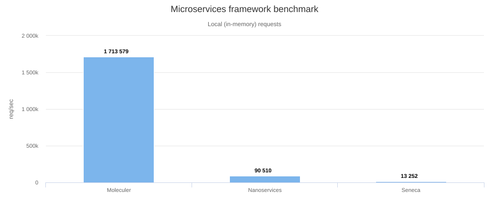
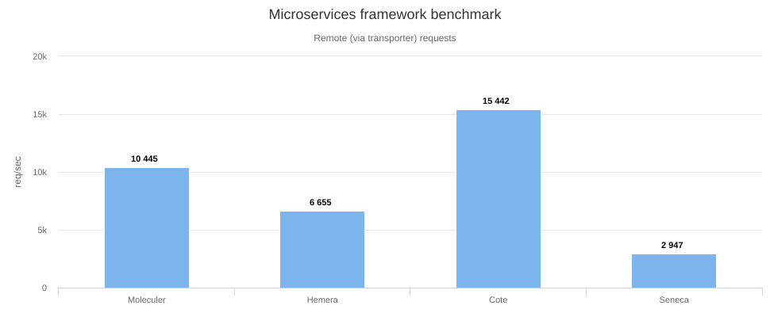

title: What is Moleculer?
---
Moleculer is a fast, modern and powerful microservices framework for [Node.js](https://nodejs.org/en/) and TypeScript. It helps you to build efficient, reliable & scalable services. Moleculer provides many features for building and managing your microservices.

If you need to split a Node.js backend into services that call each other, you normally have to assemble the distributed-systems layer yourself: a service registry and service discovery (Consul, etcd, Kubernetes DNS), client-side load balancing, a message broker for RPC and pub/sub, resilience patterns (circuit breaker, retry, timeout, bulkhead), and observability (metrics, distributed tracing). Moleculer ships all of these in one framework. Services talk to each other through a pluggable transport layer (NATS, Redis, Kafka, MQTT, AMQP or plain TCP), and the framework handles discovery, balancing and fault tolerance itself — no Kubernetes, Consul, Istio or service mesh is required, although Moleculer runs fine inside Kubernetes when you want it to.

The same code also runs as a **modular monolith**: keep every service in a single process (in-process calls, no transporter, no network latency) while the codebase is small, then move services into separate processes or containers later without changing your service code. See [Clustering](clustering.html) for the architecture options.

## Features

- Promise-based solution (async/await compatible)
- request-reply concept (RPC between services)
- support event driven architecture with balancing (load-balanced and broadcast pub/sub)
- built-in service registry & dynamic service discovery (no Consul, etcd or Kubernetes needed)
- load balanced requests & events (round-robin, random, cpu-usage, latency, sharding)
- many fault tolerance / resilience features (Circuit Breaker, Bulkhead, Retry, Timeout, Fallback)
- plugin/middleware system
- support versioned services
- support [Stream](https://nodejs.org/dist/latest-v10.x/docs/api/stream.html)s
- service mixins
- built-in caching solution (Memory, MemoryLRU, Redis)
- pluggable loggers (Console, File, Pino, Bunyan, Winston, Debug, Datadog, Log4js)
- pluggable transporters (TCP, NATS, MQTT, Redis, Kafka, AMQP 0.9, AMQP 1.0)
- pluggable serializers (JSON, JSONExt, MsgPack, Notepack, CBOR)
- pluggable parameter validator
- multiple services on a node/server
- master-less architecture, all nodes are equal
- parameter validation with [fastest-validator](https://github.com/icebob/fastest-validator)
- built-in metrics feature with reporters (Console, CSV, Datadog, Event, Prometheus, StatsD)
- built-in distributed tracing feature with exporters (Console, Datadog, Event, Jaeger, Zipkin, NewRelic)
- TypeScript support: bundled type definitions, an official [TypeScript project template](https://github.com/moleculerjs/moleculer-template-project-typescript) (`moleculer init project-typescript my-project`) and [class/decorator based services](services.html#Use-decorators)
- official [API gateway](https://github.com/moleculerjs/moleculer-web), [Database access](https://github.com/moleculerjs/moleculer-db) and many other modules...

## When to choose Moleculer

Moleculer is a good fit when:

- you are building a Node.js (or TypeScript) backend from several services that need to call each other, and you want service discovery, load balancing, retries and circuit breakers without operating Consul, etcd, Istio or a service mesh;
- you want to start as a modular monolith and move to distributed services later, without rewriting your service code;
- you need both request/response (RPC) and event-driven (pub/sub) communication between services, over a message broker such as NATS, Redis, Kafka, MQTT or AMQP;
- you want metrics and distributed tracing to be part of the framework rather than a separate integration project;
- you are building a single service or a REST API today but want to keep the option to split it later — Moleculer works as a regular web framework too (with [moleculer-web](moleculer-web.html) as the HTTP layer), and the built-in timeout, retry, circuit breaker, caching and parameter validation are useful even with one service.

Moleculer is probably **not** the right choice when:

- your team is fully committed to the NestJS ecosystem and its module/DI conventions — NestJS has a larger ecosystem and more TypeScript-first tooling, and Moleculer would be a second framework to learn;
- most of your services are not written in Node.js — Moleculer's [protocol](https://github.com/moleculer-framework/protocol) is open and there are third-party implementations, but the first-class ecosystem is Node.js;
- you need guaranteed, persistent message delivery from the core event bus — built-in events are fire-and-forget; use [moleculer-channels](https://github.com/moleculerjs/moleculer-channels) for durable queues.

## How fast?

We spent a lot of hours to improve the performance of Moleculer and create the fastest microservices framework for Node.js.

Check the results on your computer! Just clone [this repo](https://github.com/icebob/microservices-benchmark) and run `npm install && npm start`.

[Check out our benchmark results.](benchmark.html)


Until Moleculer reaches a `1.0` release, breaking changes will be released with a new minor version. For example `0.14.1`, and `0.14.4` will be backward compatible, but `0.15.0` will have breaking changes.



Moleculer follows Node.js [release cycles](https://nodejs.org/en/about/releases/) meaning that the minimum required node version is `22`.

