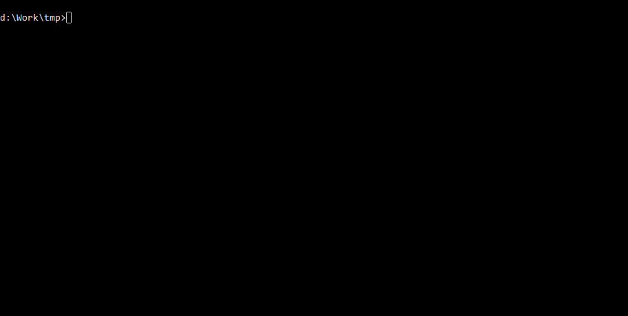

title: Usage
---
# Install Moleculer

Moleculer can be installed with `npm` or `yarn`.

```bash
$ npm i moleculer --save
```

# Create your first microservice
This basic example shows how to create a small `math` service to add two numbers and call it locally.

```js
const { ServiceBroker } = require("moleculer");

// Create a ServiceBroker
const broker = new ServiceBroker();

// Define a service
broker.createService({
    name: "math",
    actions: {
        add(ctx) {
            return Number(ctx.params.a) + Number(ctx.params.b);
        }
    }
});

// Start the broker
broker.start()
    // Call the service
    .then(() => broker.call("math.add", { a: 5, b: 3 }))
    // Print the response
    .then(res => console.log("5 + 3 =", res))
    .catch(err => console.error(`Error occured! ${err.message}`));
```


Open this example on [Runkit!](https://runkit.com/icebob/moleculer-usage)


# Create a Moleculer project
In this example we use the official [Moleculer CLI tool](moleculer-cli.html) to create a new Moleculer-based microservices project with a sample service and an API Gateway to call it from the browser via REST API.

1. Install `moleculer-cli` globally
    ```bash
    $ npm i moleculer-cli -g
    ```
2. Create a new project (named `moleculer-demo`)
    ```bash
    $ moleculer init project moleculer-demo
    ```
 <div align="center"></div>

    > Press `ENTER` to all questions _(accept default answers)_    
    
    
    Don't forget to install and start [NATS Server](https://nats.io/download/nats-io/nats-server/). Otherwise, you will get the following error:
    `NATS error. Could not connect to server: Error: connect ECONNREFUSED 127.0.0.1:4222`
    

3. Open project folder
    ```bash
    $ cd moleculer-demo
    ```

4. Start project
    ```bash
    $ npm run dev
    ```


<div align="center">
  
</div>

5. Open the [http://localhost:3000/](http://localhost:3000/) link in your browser. It shows a start page which contains two links to call the `greeter` service via [API gateway](https://github.com/moleculerjs/moleculer-web).


You have just created your first Moleculer-based microservices project! Next, check out Moleculer's [core concepts](concepts.html) page to get familiar with them and to see how they fit together. Otherwise, check our [examples](examples.html) or [demo projects](https://github.com/moleculerjs/moleculer-examples).


You can also check the video below that explains ins and outs of the project that you've just created. <iframe width="730" height="410" src="https://www.youtube.com/embed/t4YR6MWrugw" frameborder="0" allow="accelerometer; autoplay; encrypted-media; gyroscope; picture-in-picture" allowfullscreen mark="crwd-mark"></iframe>


# Moleculer Demo Playground
If you don't want to install [moleculer-demo](usage.html#Create-a-Moleculer-project) on your machine you can use interactive playground. <iframe src="https://codesandbox.io/embed/github/moleculerjs/sandbox-moleculer-project/tree/master/?fontsize=14" title="moleculer-project" allow="geolocation; microphone; camera; midi; vr; accelerometer; gyroscope; payment; ambient-light-sensor; encrypted-media" style="width:100%; height:500px; border:0; border-radius: 4px; overflow:hidden;" sandbox="allow-modals allow-forms allow-popups allow-scripts allow-same-origin" mark="crwd-mark"></iframe>