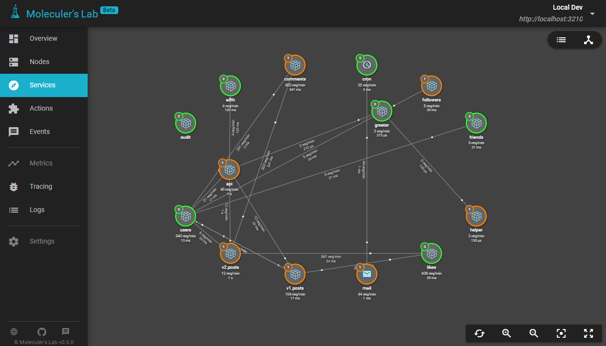
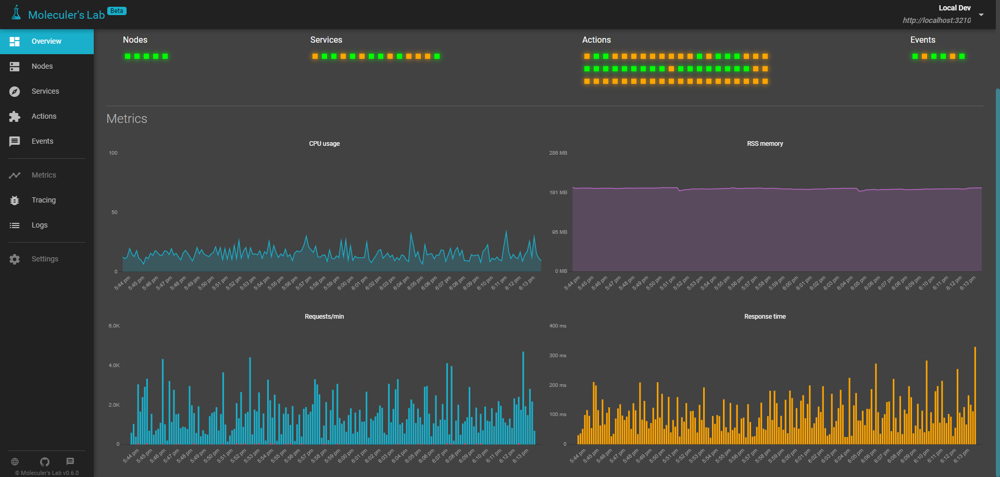
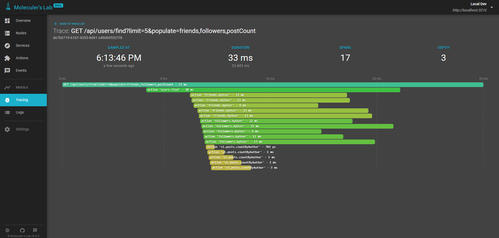

layout: normal
title: Moleculer's Laboratory
subtitle: Developer tool for Moleculer-based projects
---


## What is Moleculer's Laboratory?
Moleculer's Laboratory is a developer tool for Moleculer-based microservices projects. It's not a cloud-based [APM](https://en.wikipedia.org/wiki/Application_performance_management) service. Every collected data is stored in the Agent service local memory and in your browser. It does **NOT** upload your data to cloud storages in foreign countries, everything is in your hand. Your data is yours. 

## What is the concept?
The Moleculer Laboratory project has two main parts.

### Agent Service
This is a common Moleculer service that will be running in your project alongside the other services. It collects the data from local & remote nodes and provides the collected data to the frontend client in the browser. It starts a HTTP server on the 3210 port and waits for the browser clients. 
**It should be executed only by a single Moleculer node. Do NOT run it in every node.**

It contains 3 additional module for Moleculer:
- `MetricReporter` - it's a Metrics Reporter that collects and sends the metrics to the Agent service from remote nodes.
- `TraceExporter` - it's a Tracer Exporter that collects and sends the tracing spans to the Agent service from remote nodes.
- `EventLogger` - it's an event-based Logger that collects and sends the log messages to the Agent service from remote nodes.


Agent Service needs at least Moleculer v0.14.8.


### Frontend App
This is a visualization app that shows the collected data in your browser. It's a web application, which is hosted by us but it runs only in your browser. It connects directly to your local Agent service. It means that you don't have to expose the Agent service port (3210) to the internet! E.g.: if your project is running on your PC locally, you can use the http://localhost:3210 address in the frontend and it will work well.

**The frontend app is available on [https://lab.moleculer.services](https://lab.moleculer.services).**


If you have connectivity problem due to connection a local non-HTTPS server (mixed-content issue), enable non-secure contents for Laboratory in your browser. [More information.](https://experienceleague.adobe.com/docs/target/using/experiences/vec/troubleshoot-composer/mixed-content.html?lang=en)


## Use it in your project

### Install Lab Agent service
At first, install the Lab service with NPM.

```bash
npm i @moleculer/lab --save
```

Now create a service file to load and configure. It can be `lab.service.js` or `agent.service.js` or any other name that you like.

```js
// lab.service.js
const Laboratory = require("@moleculer/lab");

module.exports = {
    mixins: [Laboratory.AgentService],
    settings: {
        token: "<some secret text>",
        apiKey: "<your API key>"
    }
};
```
Make sure that the Lab Agent service is only loaded once and that it's running along the remaining services of your project.

#### Settings

| Name | Type | Default | Description |
| ---- | ---- | ------- | ----------- |
| `name` | `String` | `""` | The name of your project. |
| `port` | `Number` | `3210` | The Agent port. _Env var: LAB_PORT_ |
| `token` | `String` | `null` | Protect the access from others (if you expose the Agent service to the internet). It can be a static string, or if it's not set, a random token will be generated and printed to the console. _Env var: LAB_TOKEN_ |
| `apiKey` | `String` | `null` | The API key is sent to beta testers in e-mail. _Env var: LAB_APIKEY_ |

### Add additional Laboratory modules

### Metrics reporter
If you want to view metrics data on Moleculer Laboratory frontend, you should set the Laboratory Metric reporter in broker options.
```js
// moleculer.config.js
require("@moleculer/lab");

module.exports = {
    // ...
    metrics: {
        enabled: true,
        reporter: "Laboratory"
    },        
    // ...
}
```




### Trace exporter
If you want to view tracing spans on Moleculer Laboratory frontend, you should set the Laboratory Trace reporter in broker options.
```js
// moleculer.config.js
require("@moleculer/lab");

module.exports = {
    // ...
    tracing: {
        enabled: true,
        exporter: "Laboratory"
    },       
    // ...
}
```




### Laboratory logger
If you want to view log messages of nodes on Moleculer Laboratory frontend, you should set the Laboratory Logger in broker options.
```js
// moleculer.config.js
require("@moleculer/lab");

module.exports = {
    // ...
	logger: [{
		type: "Console",
		options: { /*...*/ }
	}, "Laboratory"],    
    // ...
}
```


## For beta testers
If you find any issue or you have a suggestion, please send us to the laboratory@moleculer.services e-mail address. It would be good if you could share your thoughts with us **once a week** during beta testing.

If you find an issue please describe the issue in detail, attach screenshot or video. 
> We recommend using [ShareX](https://getsharex.com/) to make screenshot or screen recording (gif, mp4). It's an awesome application.

## FAQ

### Is it open source?
No, it's a closed source project. We spent hundreds of hours to create the Lab and we know it's a very useful tool for many Moleculer developers. So we would like to make some income in order to ensure that we can continue working and improving Moleculer & Moleculer's Laboratory and adding more awesome features.

### How many projects can I use?
Any number of projects. Not limited.

### Why does it store the data only in the memory?
We've created the Laboratory as a developer tool and not an enterprise-grade APM solution with infinite data retention. There are plenty of APM companies on the market with huge budgets & human resources. We haven't and we don't want to compete with them. 

In the future, we plan to add some persistency option to the Agent Service (e.g. storing data in PostgreSQL). It means you will able to keep your collected data on your system locally as long as you want.

