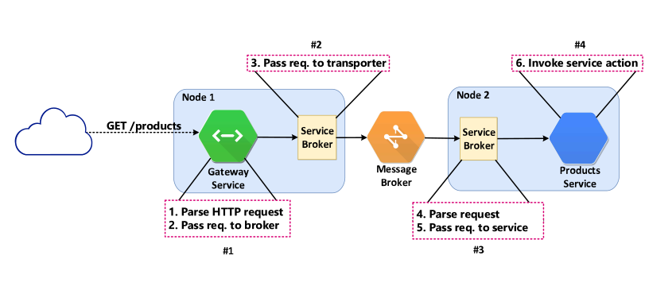

核心概念
---

本指南涵盖 Moleculer 的核心概念。

## 服务
一个[service](services.html)就是一个简单的 JavaScript 模块，它是某个复杂的应用程序的一部分。 服务是独立的, 自包含的，即使某个服务停止工作或者崩溃了，其它的服务也不会受到影响。

## 节点
节点是一个在本地或外部网络上运行的简单进程。 单个节点实例可以提供一个或多个服务。

### 本地服务
在单个节点上运行的两个(或多个) 服务被视为当地服务。 他们共享硬件资源并以本地方式相互通讯，无网络延迟(也不需要使用[transporter](#Transporter))。

### 远程服务
跨越多个节点分配的服务被认为是远程的。 在这种情况下，通过[transporter](#Transporter)进行通信。

## 服务管理者
[Service Broker](broker.html)是Moleculer的核心。 它负责各（本地和远程）服务之间的管理和通信。 每个节点至少需要有一个 Service Broker 实例。

## 推送系统
[Transporter](networking.html)用于在服务间交换信息。 它传送事件、请求和响应。

## 网关
[API 网关](moleculer-web.html)将 Moleculer 服务暴露给最终用户。 网关是一个运行 (HTTP, WebSockets 等) 服务器的 Moleculer 常规服务。 它处理收到的请求，将请求转换为服务调用，然后返回适当的响应。

## Overall View
说半天不如举个例子。 我们假设有一个网上商店，现在，只想列出它的产品。 它实际上没有在线销售任何东西。

### 架构

从构建的角度来看，这个网上商店可以被看作是两个独立服务的组合：`products` 服务和 `gateway` 服务。 Products 服务负责产品的储存和管理，gateway 服务接受用户的请求，并将其转达到`products` 服务上。

现在让我们看看怎样使用 Moleculer 来创建这个假设的商店。

To ensure that our system is resilient to failures we will run the `products` and the `gateway` services in dedicated [nodes](#Node) (`node-1` and `node-2`). If you recall, running services at dedicated nodes means that the [transporter](#Transporter) module is required for inter services communication. Most of the transporters supported by Moleculer rely on a message broker for inter services communication, so we're going to need one up and running. Overall, the internal architecture of our store is represented in the figure below.

Now, assuming that our services are up and running, the online store can serve user's requests. So let's see what actually happens with a request to list all available products. First, the request (`GET /products`) is received by the HTTP server running at `node-1`. The incoming request is simply passed from the HTTP server to the [gateway](#Gateway) service that does all the processing and mapping. In this case in particular, the user´s request is mapped into a `listProducts` action of the `products` service.  Next, the request is passed to the [broker](#Service-Broker), which checks whether the `products` service is a [local](#Local-Services) or a [remote](#Remote-Services) service. In this case, the `products` service is remote so the broker needs to use the [transporter](#Transporter) module to deliver the request. The transporter simply grabs the request and sends it through the communication bus. Since both nodes (`node-1` and `node-2`) are connected to the same communication bus (message broker), the request is successfully delivered to the `node-2`. Upon reception, the broker of `node-2` will parse the incoming request and forward it to the `products` service. Finally, the `products` service invokes the `listProducts` action and returns the list of all available products. The response is simply forwarded back to the end-user.

**Flow of user's request**
<div align="center">
    
</div>

All the details that we've just seen might seem scary and complicated but you don't need to be afraid. Moleculer does all the heavy lifting for you! You (the developer) only need to focus on the application logic. Take a look at the actual [implementation](#Implementation) of our online store.

### Implementation
Now that we've defined the architecture of our shop, let's implement it. We're going to use NATS, an open source messaging system, as a communication bus. So go ahead and get the latest version of [NATS Server](https://nats.io/download/nats-io/nats-server/). Run it with the default settings. You should get the following message:

```
[18141] 2016/10/31 13:13:40.732616 [INF] Starting nats-server version 0.9.4
[18141] 2016/10/31 13:13:40.732704 [INF] Listening for client connections on 0.0.0.0:4222
[18141] 2016/10/31 13:13:40.732967 [INF] Server is ready
```

Next, create a new directory for our application, create a new `package.json` and install the dependencies. We´re going to use `moleculer` to create our services, `moleculer-web` as the HTTP gateway and `nats` for communication. In the end your `package.json` should look like this:

```json
// package.json
{
  "name": "moleculer-store",
  "dependencies": {
    "moleculer": "^0.14.0",
    "moleculer-web": "^0.9.0",
    "nats": "^1.3.2"
  }
}
```

Finally, we need to configure the brokers and create our services. So let's create a new file (`index.js`) and do it:
```javascript
// index.js
const { ServiceBroker } = require("moleculer");
const HTTPServer = require("moleculer-web");

// Create the broker for node-1
// Define nodeID and set the communication bus
const brokerNode1 = new ServiceBroker({
  nodeID: "node-1",
  transporter: "NATS"
});

// Create the "gateway" service
brokerNode1.createService({
  // Define service name
  name: "gateway",
  // Load the HTTP server
  mixins: [HTTPServer],

  settings: {
    routes: [
      {
        aliases: {
          // When the "GET /products" request is made the "listProducts" action of "products" service is executed
          "GET /products": "products.listProducts"
        }
      }
    ]
  }
});

// Create the broker for node-2
// Define nodeID and set the communication bus
const brokerNode2 = new ServiceBroker({
  nodeID: "node-2",
  transporter: "NATS"
});

// Create the "products" service
brokerNode2.createService({
  // Define service name
  name: "products",

  actions: {
    // Define service action that returns the available products
    listProducts(ctx) {
      return [
        { name: "Apples", price: 5 },
        { name: "Oranges", price: 3 },
        { name: "Bananas", price: 2 }
      ];
    }
  }
});

// Start both brokers
Promise.all([brokerNode1.start(), brokerNode2.start()]);
```
Now run `node index.js` in your terminal and open the link [`http://localhost:3000/products`](http://localhost:3000/products). You should get the following response:
```json
[
    { "name": "Apples", "price": 5 },
    { "name": "Oranges", "price": 3 },
    { "name": "Bananas", "price": 2 }
]
```

With just a couple dozen of lines of code we've created 2 isolated services capable of serving user's requests and list the products. Moreover, our services can be easily scaled to become resilient and fault-tolerant. Impressive, right?

Head out to the [Documentation](broker.html) section for more details or check the [Examples](examples.html) page for more complex examples.